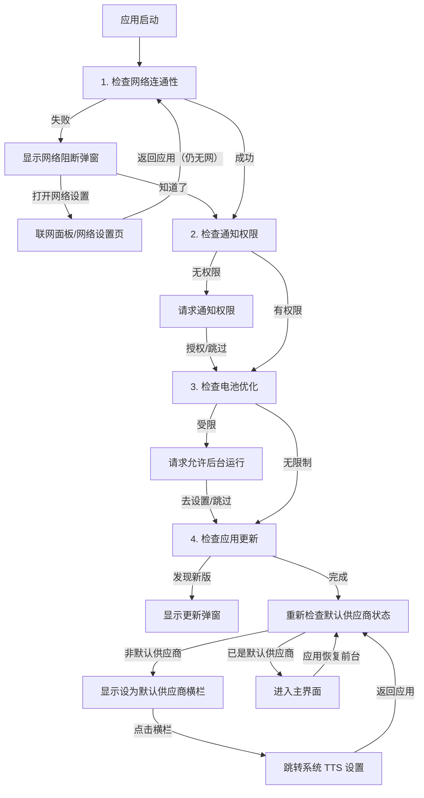

# Talkify 开发指南

本文档旨在为 Talkify 项目的开发者提供全方位的技术指导，涵盖架构设计、核心流程、代码规范及扩展指南。

## 目录

1. [项目概述](#1-项目概述)
2. [快速开始](#2-快速开始)
3. [技术架构](#3-技术架构)
4. [关键业务流程](#4-关键业务流程)
5. [配置存储方案](#5-配置存储方案)
6. [UI 与设计规范](#6-ui-与设计规范)
7. [扩展指南：添加新供应商](#7-扩展指南添加新供应商)
8. [发布与版本控制](#8-发布与版本控制)

---

## 1. 项目概述

Talkify 是一款基于 Android 的现代化 TTS (Text-to-Speech) 桥接应用。它不产生语音，而是作为**连接器**，将云端大模型（如通义千问、豆包、腾讯云）的高质量语音合成能力，以及基于 sherpa-onnx 的本地离线语音合成能力，通过 Android 标准 TTS 接口提供给系统和第三方阅读软件使用。

### 1.1 核心特性
- **云端驱动**：接入阿里云百炼（DashScope）、火山引擎（Volcengine）、腾讯云、微软 Azure、**MiniMax** 和 **小米 MiMo** 的流式 API。
- **本地离线**：基于 sherpa-onnx 引擎，支持 VITS（中文/粤语）和 Kokoro（多语言）模型的离线语音合成，无需网络即可使用。
- **架构解耦**：采用插件化架构，轻松扩展新的 TTS 服务商（云端或本地均可）。
- **体验流畅**：完整的启动检查流程（网络/权限/电池优化），确保服务在后台稳定运行。
- **清爽界面**：配置项按使用频率分层展示，"高级设置"（API 地址、模型 ID 等）默认折叠，减少视觉干扰。

---

## 2. 快速开始

### 2.1 环境要求
- **IDE**: Android Studio Ladybug | 2024.2.1+
- **JDK**: JDK 17
- **Android SDK**: API 37 (compileSdk/targetSdk) / minSdk 30

### 2.2 常用命令

项目使用 Gradle 进行构建管理：

```bash
# Debug 构建（开发调试）
./gradlew assembleDebug

# Release 构建（正式包）
./gradlew assembleRelease

# 代码检查 (Lint)
./gradlew lint

# 运行单元测试
./gradlew test

# 清理构建缓存
./gradlew clean
```

### 2.3 依赖说明
关键依赖版本管理位于 `gradle/libs.versions.toml`：
- **UI**: Jetpack Compose BOM 2026.06.01
- **Navigation**: Navigation Compose 2.9.8
- **Network**: OkHttp 4.12.0（锁定版本以兼容 DashScope SDK）
- **AI SDK**: DashScope SDK 2.22.27
- **Kotlin**: 2.4.10
- **AGP**: 9.4.0
- **腾讯云TTS**: stream_tts-release-v2.0.16-20260128-d80cafe（本地 AAR，位于 `app/libs/`，由 `app/build.gradle.kts` 通过 `files()` 引入）
- **MP3解码**: JLayer 1.0.1 (用于微软TTS和MiniMax供应商的流式MP3解码)
- **本地TTS引擎**: sherpa-onnx v1.13.1（离线语音合成引擎，支持 VITS 和 Kokoro 模型）。使用官方 **static-link-onnxruntime** 构建，以本地 AAR 引入（`app/libs/sherpa-onnx-static-link-onnxruntime-1.13.1.aar`，同腾讯云 AAR 的 `files()` 方式）。勿改回 JitPack 坐标 `com.github.k2-fsa:sherpa-onnx`——该构建动态链接全量 onnxruntime `.so`，曾是 APK 膨胀至 140MB 的主因。**必须在 `app/proguard-rules.pro` 保留 sherpa-onnx 与 `SherpaCallbackBridge` 的 keep 规则**：JNI 层按名字反射访问 `OfflineTtsConfig` 字段与回调方法，R8 混淆后会在 release 包崩溃（`fid == null` SIGABRT）。
- **压缩解压**: commons-compress 1.28.0（tar.bz2 解压，用于 Kokoro 模型 espeak-ng-data 等归档资源）
- **匿名统计**: Umami（自建实例，基础统计经 `/api/send`、录制增强经 `/api/record` HTTP 接口上报，零 SDK 依赖，官方脚本源码存于 `doc/umami/`）

---

## 3. 技术架构

Talkify 严格遵循 **MVVM (Model-View-ViewModel)** 架构模式，配合 **Clean Architecture** 的分层思想，实现逻辑与 UI 的分离。

### 3.1 核心目录结构

```text
app/src/main/java/com/github/lonepheasantwarrior/talkify/
├── MainActivity.kt                       // 【容器】极简容器，设置导航图与音量控制
├── TalkifyApplication.kt                 // 【应用类】应用初始化、通知通道创建
├── TalkifyExceptionHandler.kt            // 【异常处理】全局未捕获异常处理器
├── TalkifyAppHolder.kt                   // 【全局 Context】应用 Context 持有者（ServiceLocator）
├── TalkifyCheckDataActivity.kt           // 【检查页】供应商数据完整性校验
├── TalkifyDownloadVoiceDataActivity.kt   // 【契约页】系统 INSTALL_TTS_DATA 契约 Activity（空壳）
├── TalkifySampleTextActivity.kt          // 【样本文本】预置示例文本管理
├── util/                                 // 【工具层】通用工具类
│   └── TalkifyAudioPlayer.kt             // 音频播放工具（语音预览）
├── domain/                               // 【领域层】纯 Kotlin 业务接口与模型
│   ├── model/                            // 供应商配置、更新信息等数据模型
│   │   ├── BaseProviderConfig.kt         // 供应商配置基类（voiceId/apiUrl/modelId）
│   │   ├── ConfigItem.kt                 // 配置项模型（placeholder/弹窗编辑器/指南内容等）
│   │   ├── ProviderIds.kt                // 供应商 ID 密封类（providerId/defaultModelId/provider）
│   │   ├── AliyunBailianConfig.kt         // 阿里云百炼（通义千问）供应商配置
│   │   ├── VolcengineConfig.kt           // 火山引擎（豆包 Seed TTS）供应商配置
│   │   ├── TencentCloudConfig.kt         // 腾讯云语音合成供应商配置
│   │   ├── AzureConfig.kt                // 微软 Azure 语音合成供应商配置
│   │   ├── MiniMaxConfig.kt              // MiniMax 语音合成供应商配置
│   │   ├── XiaomiConfig.kt               // 小米 MiMo 语音合成供应商配置
│   │   ├── LocalModelConfig.kt            // 本地模型配置（voiceId, modelId, apiUrl）
│   │   ├── LocalModelInfo.kt              // 本地模型元数据（modelType, downloadFileInfo, voiceList, 采样率, 支持语言）
│   │   ├── LocalModelRegistry.kt          // 本地模型注册表（模型清单、下载源、语音列表的统一数据源）
│   │   ├── TtsProviderRegistry.kt        // 供应商注册中心（基于 ProviderIds 管理供应商元信息）
│   │   ├── TtsModels.kt                  // TTS 相关数据模型
│   │   ├── UpdateCheckResult.kt          // 更新检查结果模型
│   │   └── UpdateInfo.kt                 // 更新信息模型
│   └── repository/                       // 仓储接口定义 (Repository Interfaces)
│       ├── AppConfigRepository.kt        // 应用配置仓储接口
│       ├── ProviderConfigRepository.kt   // 供应商配置仓储接口
│       └── VoiceRepository.kt            // 音色仓储接口
├── infrastructure/                       // 【基础设施层】技术实现细节
│   ├── app/                              // 应用级设施
│   │   ├── notification/                 // 通知管理
│   │   │   ├── NotificationHelper.kt      // 通知通道创建与通知构建
│   │   │   ├── NotificationModels.kt      // TalkifyNotificationChannel 枚举、通知数据类
│   │   │   └── TalkifyNotificationHelper.kt // 业务通知快捷发送
│   │   ├── permission/                   // 权限管理
│   │   │   ├── ConnectivityMonitor.kt
│   │   │   ├── NetworkConnectivityChecker.kt
│   │   │   └── PermissionChecker.kt
│   │   ├── power/                        // 电源管理
│   │   │   └── PowerOptimizationHelper.kt
│   │   ├── telemetry/                    // 匿名遥测统计
│   │   │   ├── TalkifyTelemetry.kt        // 遥测门面（业务层唯一入口）
│   │   │   ├── UmamiClient.kt             // Umami 传输层（/api/send 协议封装）
│   │   │   ├── DeviceInfoCollector.kt    // 匿名设备信息收集服务（零权限）
│   │   │   ├── TtsTelemetryTracker.kt    // 语音合成事件埋点（每次合成均上报）
│   │   │   ├── AppActionTracker.kt       // 应用动作事件埋点（点击/触发功能类）
│   │   │   ├── AppPageTracker.kt         // 应用页面导航埋点（打开页面/抽屉/弹窗 = pageview）
│   │   │   └── recorder/                  // 增强录制子系统（会话回放&热图）
│   │   │       ├── UmamiRecorder.kt       // recorder 门面（探测→抽样→等会话令牌→装配）
│   │   │       ├── UmamiRecorderConfig.kt // 服务端配置探测（/api/websites/{id}/recorder）
│   │   │       ├── RecordTransport.kt     // /api/record 传输层（批量/分片/单调时间戳）
│   │   │       ├── Rrweb.kt               // rrweb 事件协议常量与事件构造器
│   │   │       ├── UiSnapshot.kt          // 语义树中间表示（平台无关）
│   │   │       ├── RrwebSnapshotBuilder.kt // rrweb DOM 快照序列化器（纯函数）
│   │   │       ├── ReplaySession.kt       // 回放会话（无障碍树捕获 → rrweb 事件流）
│   │   │       └── HeatmapSession.kt      // 热图会话（点击/滚动深度状态机）
│   │   ├── update/                       // 更新检查
│   │   │   └── UpdateChecker.kt         // GitHub API 版本检查
│   │   └── repo/                         // 配置仓储实现
│   │       └── SharedPreferencesAppConfigRepository.kt
│   ├── provider/                         // 供应商级设施
│   │   └── repo/                         // 供应商仓储实现（统一继承泛型基类）
│   │       ├── BasePrefsConfigRepository.kt   // 配置仓储泛型基类（serialize/deserialize 映射，无模板代码）
│   │       ├── AliyunBailianConfigRepository.kt
│   │       ├── AliyunBailianVoiceRepository.kt
│   │       ├── VolcengineConfigRepository.kt
│   │       ├── VolcengineVoiceRepository.kt
│   │       ├── TencentCloudConfigRepository.kt
│   │       ├── TencentCloudVoiceRepository.kt
│   │       ├── AzureConfigRepository.kt
│   │       ├── AzureVoiceRepository.kt
│   │       ├── MiniMaxConfigRepository.kt
│   │       ├── MiniMaxVoiceRepository.kt
│   │       ├── XiaomiConfigRepository.kt
│   │       ├── XiaomiVoiceRepository.kt
│   │       ├── BaseXmlVoiceRepository.kt      // XML 音色仓储基类（lazy 解析 + 供应商校验 + 映射钩子）
│   │       ├── LocalModelConfigRepository.kt // 本地模型配置仓储（SharedPreferences）
│   │       └── LocalModelVoiceRepository.kt  // 本地模型音色仓储（从 Registry 读取，构造注入配置仓储）
│   │   └── local/                         // 本地模型基础设施
│   │       ├── SherpaTtsEngine.kt         // sherpa-onnx 引擎封装（VITS/Kokoro 初始化与合成）
│   │       ├── SherpaCallbackBridge.java  // JNI 回调桥接（Java 端回调接口，供 C++ 引擎调用）
│   │       ├── LocalModelManager.kt       // 模型生命周期管理（下载状态、完整性校验、文件路径）
│   │       └── LocalModelDownloadService.kt // 前台下载服务（Notification + 进度通知）
│   └── xml/                              // XML 资源解析工具
│       ├── VoiceXmlEntry.kt              // 音色 XML 条目数据类
│       └── VoiceXmlParser.kt             // 音色 XML 解析器
├── service/                              // 【服务层】Android Service 实现
│   ├── TalkifyTtsService.kt              // 系统 TTS 服务入口
│   ├── TtsPreviewPlayer.kt               // 语音预览播放器（供应商合成 + 本地播放，非 Android Service）
│   ├── TtsErrorCode.kt                   // 错误码定义
│   ├── TtsErrorHelper.kt                 // 错误处理工具
│   ├── TtsLogger.kt                      // 日志工具
│   ├── provider/                         // TTS 供应商统一抽象
│   │   ├── AbstractTtsProvider.kt        // 供应商抽象基类（元数据钩子下沉）
│   │   ├── HttpStreamingTtsProvider.kt   // HTTP 流式供应商模板基类（共享 OkHttp + 分块流水线挂载）
│   │   ├── ChunkPipelineExecutor.kt      // 分块预取流水线执行器（窗口=2，按序 flush，背压）
│   │   ├── TtsProviderApi.kt             // 供应商接口定义
│   │   ├── TtsProviderFactory.kt         // 供应商工厂
│   │   ├── AudioConfig.kt                // 音频配置
│   │   ├── TextChunkSplitter.kt          // 文本分块工具（按句子边界智能切分）
│   │   ├── Mp3StreamDecoder.kt           // MP3 流式解码器（共享 JLayer 解码循环）
│   │   ├── HexCodec.kt                   // 十六进制音频解码（查表实现）
│   │   ├── ParamMappers.kt               // Android TTS 参数 → 各供应商 API 参数映射
│   │   ├── ProviderErrorParsers.kt       // 各供应商错误响应 → 中文消息映射
│   │   ├── WavHeaderSanitizer.kt         // WAV 头识别与剥离
│   │   └── impl/                         // 具体供应商实现
│   │       ├── AliyunBailianProvider.kt
│   │       ├── VolcengineProvider.kt     // 继承 HttpStreamingTtsProvider（接入预取流水线）
│   │       ├── TencentCloudProvider.kt
│   │       ├── AzureProvider.kt
│   │       ├── MiniMaxProvider.kt
│   │       ├── XiaomiProvider.kt         // 继承 HttpStreamingTtsProvider（接入预取流水线）
│   │       └── LocalModelProvider.kt       // 本地模型离线合成供应商（sherpa-onnx，引擎空闲自动释放）
└── ui/                                   // 【表现层】Jetpack Compose UI
    ├── components/                       // 通用 UI 组件
    │   ├── BatteryOptimizationDialog.kt
    │   ├── ConfigBottomSheet.kt          // 配置弹窗（含本地模型选择、下载状态显示、下载触发）
    │   ├── ConfigEditor.kt
    │   ├── ProviderSelector.kt
    │   ├── MarkdownText.kt
    │   ├── NetworkBlockedDialog.kt       // 网络阻断弹窗（离线可用性自适应文案，可"知道了"继续）
    │   ├── NotificationPermissionDialog.kt
    │   ├── UpdateDialog.kt
    │   └── VoicePreview.kt
    ├── screens/                           // 页面级 Composable
    │   ├── MainScreen.kt                  // 主界面（含默认供应商提示、关于应用提示横栏、语音预览、供应商配置）
    │   └── AboutScreen.kt                 // 关于页面（含检查更新、打赏功能）
    ├── viewmodel/                         // 状态管理（组合根 + 领域控制器）
    │   ├── MainViewModel.kt              // 组合根：聚合三个状态域暴露给 MainScreen
    │   ├── startup/StartupCoordinator.kt // 启动检查状态机（网络/权限/电池/更新/默认供应商）
    │   ├── preview/PreviewPlaybackController.kt // 语音预览状态与播放控制
    │   └── localmodel/LocalModelDownloadController.kt // 下载进度、广播接收、冲突检测
    └── theme/                            // Material 3 主题定义
        ├── Color.kt
        ├── Theme.kt
        └── Type.kt
```

### 3.2 架构设计详解

#### 3.2.1 启动流程架构 (MVVM)
应用启动涉及多个复杂的异步检查步骤。为了避免 `MainActivity` 代码膨胀和弹窗冲突，我们采用 **State Machine（状态机）** 模式：

- **ViewModel (`MainViewModel`)**: 维护单一真实数据源 `startupState` (`StartupState`)。它按顺序调度检查任务，控制流程流转。
- **View (`MainScreen`)**: 响应式 UI。根据 `startupState` 的变化（如 `CheckingNetwork`, `CheckingBatteryOptimization`）动态切换显示的弹窗或内容。
- **Activity (`MainActivity`)**: 极简容器，不处理任何逻辑。

#### 3.2.2 TTS 供应商架构 (Plugin-based)
供应商模块采用接口隔离设计，确保新增供应商不影响现有代码：
- **`TtsProviderApi`**: 定义标准行为（合成、停止、释放、声音查询、配置标签、默认 API 地址/模型 ID 暴露等），配套 `SynthesisParams` 封装合成参数。
- **`TtsSynthesisListener`**: 合成结果回调接口，支持音频数据流式回传、错误处理和完成通知。
- **`AbstractTtsProvider`**: 提供通用实现（日志、释放状态检查、可朗读文本检测、元数据方法下沉）。音色/语言类元数据基于钩子属性实现：
  - `voiceIds`（XML 音色列表）/ `fallbackVoiceId`（兜底音色）/ `supportedLanguages`（支持语言）/ `configLabels`（配置项标签映射）
  - 基类据此统一实现 `getSupportedVoices()` / `getDefaultVoiceId()` / `isVoiceIdCorrect()` / `getSupportedLanguages()` / `getDefaultLanguage()`（对齐 `TextToSpeechService#onGetLanguage` 的 [lang, country, variant] 三元组契约）/ `getConfigLabel()`
  - 音色模型特殊的供应商（阿里云 SDK 枚举、Azure、本地模型注册表）直接覆写对应方法
  - `isConfigured()` 经类型安全的 `isConfiguredAs<C>(config) { predicate }` 实现
- **`HttpStreamingTtsProvider`**: HTTP 流式供应商模板基类（火山引擎、小米 MiMo 继承）。统一负责：
  - 合成入口校验（配置/空文本/可读文本）与 `TextChunkSplitter` 分块
  - 分块预取流水线（`ChunkPipelineExecutor`）与音频按序 flush
  - 全局共享 OkHttpClient（连接池复用，keep-alive 45s）
  - 请求级取消（in-flight call 集合管理）、首个音频块触发 `onSynthesisStarted`
  - 子类仅实现 `validateConfig` / `buildHttpRequest` / `processStreamResponse` / `mapHttpError` / `chunkMaxLength`
- **共享纯函数工具**（可单元测试）：`Mp3StreamDecoder`（JLayer 解码循环）、`HexCodec`（hex 音频查表解码）、`ParamMappers`（参数映射）、`ProviderErrorParsers`（错误消息映射）、`WavHeaderSanitizer`（WAV 头剥离）。
- **`AbstractTtsProvider` 之外的特例**：`AliyunBailianProvider` 使用 DashScope SDK 独立实现串行分块（SDK 全局 `Constants.baseHttpApiUrl` 静态端点限制，代码中有注释说明）；`TencentCloudProvider` 受官方 SDK 会话模型限制保持串行分块（单块 30s 超时保护）。`LocalModelProvider` 继承 `AbstractTtsProvider`（元数据钩子 + 动态采样率 `getAudioConfig()`），引擎管理自行实现。
- **`TtsProviderRegistry`**: 供应商注册中心，以 `ProviderIds` 密封类为单一数据源（每个子对象包含 `providerId` 唯一标识、`defaultModelId` 默认模型、`provider` 展示名称三个属性），管理所有可用供应商元信息，并通过 `ProviderIds.toTtsProvider()` 扩展函数转换为 UI 数据模型 `TtsProvider`。
- **`TtsProviderFactory`**: 供应商实例工厂，基于 DCL（双重检查锁定）延迟初始化注册表，统一管理 Provider、ConfigRepo、VoiceRepo 三种组件的创建，是插件化架构的核心入口。

##### 分块预取流水线（ChunkPipelineExecutor）

火山引擎与小米 MiMo 的长文本按块（300/768 字符）流式合成。串行模式下块间插入一次完整网络往返（RTT + 首包延迟），产生规律性停顿。流水线以滑动窗口（window=2）让当前块音频传输期间后续块请求已在服务端排队：

- **顺序不变量**：音频 flush 严格按块序号进行；后续块音频暂存于块级有限容量 Channel（64 条，越界即背压挂起 fetch，TCP 层反压服务端）
- **取消**：`stop()` 标记 + 取消全部 in-flight HTTP 请求；块失败时取消剩余请求，失败块之后的内容不再输出
- **音频通道传递**：sink 经协程上下文元素（`AudioSinkElement`）注入，并发 fetch 无共享状态
- **边界**：单块文本自动退化为直连路径；Azure（自有 WebSocket 流水线）、阿里云/腾讯（SDK 限制）不接入

##### 自定义 API 地址与模型 ID
每个供应商通过 `getDefaultApiUrl()` 和 `getDefaultModelId()` 暴露其默认端点和模型标识：
- 用户可在配置界面自定义 API 地址和模型 ID，未配置时自动回退到供应商默认值
- 合成时通过 `config.apiUrl.ifBlank { defaultApiUrl }` 实现优先级回退
- 当用户自定义了模型 ID 时，供应商选择器和列表中的"模型名称"展示会自适应更新
- 不支持自定义的供应商（如腾讯云使用官方 SDK）返回空字符串，配置界面自动隐藏对应字段

#### 3.2.3 应用初始化架构
- **`TalkifyApplication`**: 应用入口类，负责：
  - 初始化 `TalkifyAppHolder` 全局上下文（供供应商等组件获取 Context）
  - 注册 `TalkifyExceptionHandler` 全局异常处理器
  - 预创建两个通知通道：`TTS_PLAYBACK`（前台服务常驻）和 `SYSTEM_NOTIFICATION`（系统级通知）
  - 注册 `ProcessLifecycleOwner` 应用级生命周期观察：每次应用**回到前台**（进程冷启动、任务划走后重开、温热重进）上报一次 pageview 会话锚点 + 附带 `DeviceInfoCollector` 匿名设备画像的 `app_opened` 事件；启动信号不挂在 `Application.onCreate`，因为 TTS 前台服务常驻、任务划走后进程仍存活，重开应用不会重建进程
- **`TalkifyExceptionHandler`**: 全局未捕获异常处理器，捕获崩溃后：
  - 发送系统通知提示用户
  - 弹出崩溃对话框（支持"重启应用"和"报告问题"两个选项）
- **`TalkifyAppHolder`**: 全局 Context 持有者，避免供应商层对 Android 组件的直接依赖

#### 3.2.4 匿名遥测架构 (Umami)

Talkify 集成自建 [Umami](https://umami.is/) 实例进行**隐私优先**的匿名使用统计，帮助开发者了解活跃设备数及核心功能使用情况，**不收集任何可标识用户或设备的信息**。遥测通过 Umami 的 `POST /api/send` HTTP 接口上报，**无任何 SDK 依赖**（复用工程内已有的 OkHttp 与 org.json）。

##### 分层设计

telemetry 模块内部按职责分为四层，业务层只依赖门面：

| 层 | 组件 | 职责 |
|----|------|------|
| 门面层 | `TalkifyTelemetry` | 业务层唯一入口，屏蔽底层实现，更换统计后端业务代码零改动 |
| 语义层 | `TtsTelemetryTracker` / `AppActionTracker` / `AppPageTracker` | 集中定义埋点 schema（合成作业事件 / 点击触发类动作事件 / 页面导航 pageview） |
| 画像层 | `DeviceInfoCollector` | 匿名设备信息收集（零权限） |
| 传输层 | `UmamiClient` | Umami `/api/send` 协议封装（端点、网站 ID、payload 组装、异步发送） |

##### 核心组件

- **`TalkifyTelemetry`** (`infrastructure/app/telemetry/`): 遥测门面（`object` 单例），对外暴露 `trackPageView(url, title)`、`trackEvent(name)`、`trackEvent(name, properties)` 和 `identify(properties)` 四个方法。
- **`UmamiClient`** (`infrastructure/app/telemetry/`): Umami 传输客户端（`object` 单例），唯一知晓 Umami 协议细节的组件。
  - **自举设计**：通过 `TalkifyAppHolder` 自主获取 Context，不依赖调用方传入，调用方无需关心初始化状态。
  - **公共属性注入**：自动为每个自定义事件附加 `app_version` 与 `os_version`，调用方无需手动携带，所有事件均可按版本/系统筛选。
  - **会话缓存协议**：解析每次上报的响应 `{cache, disabled}`——`cache` 会话令牌在后续请求的 `x-umami-cache` 头原样带回（缺失时省略该头），`disabled=true` 时所有上报静默停播；请求恒带 `x-umami-website-id` 与 `x-umami-hostname` 头。会话令牌同时是 recorder 子系统的会话锚点。
  - **identify 支持**：`identify(properties)` 以 `type: "identify"` 上报会话画像（带 `data` 不带 `name`），对齐官方 script.js 的 `umami.identify()`。
  - **零阻塞**：基于 OkHttp 异步请求（`enqueue`），调用后立即返回。
  - **容错隔离**：Context 尚未就绪则静默跳过；网络失败仅记录日志，遥测绝不引发崩溃。
- **`TalkifyApplication`（`ProcessLifecycleOwner` 观察者）**: 应用层唯一一处直接调用 `TalkifyTelemetry` 的位置，每次应用回到前台先上报一次 pageview 作为会话锚点，再上报附带设备画像的 `app_opened` 事件，随后启动/停止 recorder 录制会话（见下文 recorder 子系统）。

##### SPA 路由 pageview 补发（MainActivity）

对齐 script.js 的 SPA 行为：`MainActivity` 监听 `NavController` 的 destination 变化，路由指向新页面时补发一次 pageview（驱动 Pages 面板）并通知 recorder 产出 `url-change` 事件与重拍回放快照。路由映射：`main → "/"`、`about → "/about"`；以附着时的当前路由初始化去重基线，避免重组/恢复时对同一页面重复上报。

##### 上报 payload

每次上报向 `/api/send` 发送如下 JSON（`data` 为事件自定义属性）：

```json
{
  "type": "event",
  "payload": {
    "website": "<Umami 网站 ID>",
    "hostname": "com.github.lonepheasantwarrior.talkify",
    "language": "zh-CN",
    "referrer": "",
    "screen": "1080x2400",
    "url": "/",
    "name": "<事件名称>",
    "data": { "<属性>": "<值>" }
  }
}
```

`hostname` 与 Umami 后台网站的 Domain 设置保持一致（即应用包名），保证仪表盘筛选与展示一致。`payload` **不带 `name` 即为 pageview**，带 `name` 即为自定义事件。

OS 名称及版本、App 版本号通过 `User-Agent` 请求头附带（`Talkify/<versionName> (Linux; Android <osVersion>; <model>)`），Umami 自动解析为 OS/浏览器统计；匿名会话由 Umami 基于 IP + User-Agent 哈希派生。

##### Pageview 与自定义事件的角色分工

Umami 的指标统计口径是理解仪表盘数据的关键：

- **Pageview（不带 `name`）**：驱动访客（Visitors）、访问（Visits）、浏览量（Views）及 Pages、Browsers/OS/Devices、Countries 等所有核心面板
- **自定义事件（带 `name`）**：**不参与**上述任何指标计算，仅显示在页面底部的事件（Events）区域，可在其中查看 `data` 属性明细

因此应用启动时通过 `trackPageView()` 上报一次 pageview 作为会话锚点，保证仪表盘核心指标可用；业务动作用 `trackEvent()` 上报自定义事件，避免污染浏览量。

**"去了哪里"与"做了什么"的分界**（新增埋点前必读）：

- **去了哪里**（pageview）：进入某个页面、抽屉或弹窗 = 一次 pageview。全屏页面（"/"、"/about"）由 NavController 监听上报；抽屉/弹窗按 `AppPageTracker` 的虚拟路由在**打开时机**上报一次，关闭不补发。Pages 面板中各路径的浏览量即"该界面被打开的次数"
- **做了什么**（event）：点击/触发某项功能 = 自定义事件，由 `AppActionTracker` 定义
- 纯结果反馈（"已是最新版本"提示框、打赏保存指引、崩溃对话框）不是导航目的地，不设路径，其信息由触发事件的 result 属性承载

##### DeviceInfoCollector 收集的信息

所有信息均来自 Android 公开 API，**零权限**，不收集 IMEI、MAC、Advertising ID 等可标识信息：

| 属性 | 来源 API | 类型 | 用途 |
|------|---------|:---:|------|
| `device_model` | `Build.MODEL` | String | 设备型号分布 |
| `device_brand` | `Build.BRAND` | String | 品牌分布 |
| `manufacturer` | `Build.MANUFACTURER` | String | 制造商分布 |
| `device_codename` | `Build.DEVICE` | String | 设备代号 |
| `soc_platform` | `Build.HARDWARE` | String | 芯片平台（兼容性分析） |
| `screen_density` | `DisplayMetrics` | String | 屏幕密度档位 (ldpi ~ xxxhdpi) |
| `country` | SIM 运营商 → Locale 降级 | String | 国家级区域分布 |
| `total_ram_mb` | `ActivityManager` | Int | 设备内存容量 |
| `is_low_ram_device` | `ActivityManager.isLowRamDevice()` | Int | 低端设备识别 |
| `network_type` | `ConnectivityManager` | String | 联网方式 (wifi/cellular/ethernet/vpn) |

##### 设计原则

- **自举设计**：遥测链路无需外部管理生命周期，Context 尚未就绪（极端情况）时静默跳过，绝不影响业务主流程。
- **低耦合**：Umami 协议细节（端点、网站 ID、payload 结构）全部收敛在 `UmamiClient` 内，其余组件零感知。
- **不重复**：OS 版本、App 版本、语言、屏幕分辨率由 `UmamiClient` 随每次请求自动附带，`DeviceInfoCollector` 不再重复收集。
- **类型合规**：所有自定义属性值严格使用 String 或 Int。
- **容错隔离**：`DeviceInfoCollector` 每个信息采集方法独立封装并带 try-catch，单项失败不影响其它项及主流程；上报失败仅记录日志。
- **区域降级**：国家代码获取采用双重策略：SIM 卡注册网络运营商 → 系统 Locale，仅精确到国家级。
- **可扩展**：新增信息项只需在 `DeviceInfoCollector` 中添加一个 `collectXxx()` 私有方法；更换统计后端只需重写 `UmamiClient`。

##### 添加新的事件追踪

在任意位置通过 `TalkifyTelemetry` 统一上报：

```kotlin
// 简单事件
TalkifyTelemetry.trackEvent("event_name")

// 带属性的复合事件
TalkifyTelemetry.trackEvent("event_name", mapOf(
    "key" to "string_value",
    "count" to 42
))
```

> **注意**：整个应用应通过 `TalkifyTelemetry` 上报事件，**不要**直接引用 `UmamiClient`。自定义属性仅支持 `String` 和 `Int` 类型，`Boolean` 需转为 `0/1` 整数。业务动作事件应优先走语义层（`TtsTelemetryTracker` / `AppActionTracker`），使事件名与属性 schema 收敛在遥测模块内；仅在临时调试时直接调用 `TalkifyTelemetry.trackEvent`。`trackEvent` 还接受可选的 `url` 参数（默认 "/"），关于页事件传 `"/about"` 可在仪表盘按页面拆分。

##### TtsTelemetryTracker —— 语音合成事件埋点

`TtsTelemetryTracker` (`infrastructure/app/telemetry/`) 负责埋点语音合成作业。**在合成完成后上报一次**：开始前通过 `begin()` 创建 `Attempt` 计时器，在各类出口调用 `mark*()` 标记终态，最终在 service 的 `finally` 统一出口调用 `report()`——天然覆盖成功、供应商错误、超时、用户取消、异常中断全部出口，每次合成恰上报一条（无限频、无采样）。

**上报事件**：

| 事件名称 | 属性 | 说明 |
|---------|------|------|
| `tts_synthesis` | `provider_id` (String) | 供应商 ID |
| | `model_id` (String) | 有效模型 ID（空则记为 `default`） |
| | `voice_id` (String) | 音色 ID（空则记为 `default`） |
| | `text_length` (Int) | 待合成文字字数 |
| | `status` (String) | 合成结果：success / error / timeout / cancelled |
| | `duration_ms` (Int) | 合成总耗时（毫秒，开始 → 终态） |
| | `duration_bucket` (String) | 耗时分桶：<1s / 1-3s / 3-10s / 10-30s / >30s，供仪表盘直读耗时分布 |
| | `first_audio_ms` (Int) | 首包音频延迟（毫秒，流式合成的体感时延；未收到音频时缺省） |
| | `sample_rate` (Int) | 首包音频采样率（Hz，供应商音质核查；未收到音频时缺省） |
| | `error_code` (String) | 失败原因（仅失败时）：TtsErrorCode 数值或异常类名 |

成功率 = `status=success` 占比，在 Umami 事件属性筛选中直接查看。

**线程模型**：`markFirstAudio()` 由 provider 回调线程调用（首包字段用 `@Volatile` 保证可见性），其余 `mark*()` 与 `report()` 均在合成主作业线程调用。

**调用示例**：

```kotlin
// TalkifyTtsService.processRequestSynchronously() 中：
var attempt: TtsTelemetryTracker.Attempt? = null   // try 之前声明
...
attempt = TtsTelemetryTracker.begin(providerId, effectiveModelId, config.voiceId, text.length)
// provider 回调首次产出音频时：
attempt?.markFirstAudio(sampleRate)
// 结果处理各分支：
attempt?.markSuccess()          // 或 markError(code) / markTimeout() / markCancelled()
...
finally {
    attempt?.report()           // 统一出口上报
}
```

##### AppPageTracker —— 应用页面导航埋点（pageview）

`AppPageTracker` (`infrastructure/app/telemetry/`) 埋点"**去了哪里**"：进入某个页面、抽屉或弹窗 = 一次 pageview（虚拟路由），驱动 Pages 面板与浏览量。与 [AppActionTracker] 的"做了什么"（事件）严格分工——**打开界面/抽屉/弹窗绝不是事件**。

| 路径 | 界面 | 上报时机 |
|------|------|---------|
| `/` | 主界面 | NavController 监听（MainActivity）+ 启动会话锚点 |
| `/about` | 关于页 | NavController 监听（MainActivity） |
| `/config` | 配置面板抽屉 | `isOpen` 变为 true 时（覆盖 FAB 与未配置引导等所有入口） |
| `/provider-select` | 供应商选择抽屉 | 主界面卡片点击（选定供应商是 `provider_switched` 事件） |
| `/donate` | 打赏抽屉 | 打赏按钮点击 |
| `/privacy` | 关于隐私弹窗 | 隐私卡片点击 |
| `/model-download-confirm` | 模型下载确认弹窗 | 弹窗置位时（配置面板保存 / 预览播放两处入口共用） |
| `/update` | 更新弹窗 | 弹窗置位时（启动自动 / 关于页手动两处入口共用） |
| `/network-blocked` | 启动·网络阻断弹窗 | 状态机进入 NetworkBlocked |
| `/notification-permission` | 启动·通知权限弹窗 | 状态机进入 RequestingNotificationPermission |
| `/battery-optimization` | 启动·电池优化弹窗 | 状态机进入 RequestingBatteryOptimization |

**约定**：虚拟路由只在**打开时机**上报一次（点击回调 / 状态机转移处，严禁放在 Composable 组合体内，重组会重复上报）；关闭不补发（回到原界面不产生新导航），因此虚拟路径的浏览量 = 该界面被打开的次数；pageview 不携带 data 属性，打开场景的附加信息由后续动作事件承载；recorder 录制不跟随虚拟路由（抽屉/Compose 弹窗属独立窗口，本就不被采集）。

##### AppActionTracker —— 应用动作事件埋点

`AppActionTracker` (`infrastructure/app/telemetry/`) 埋点"**做了什么**"——点击/触发功能类动作（预览播放、配置保存、模型下载、更新检查、打赏、启动检查选择、崩溃等），与 `TtsTelemetryTracker`（语音合成作业）、`AppPageTracker`（页面导航）并列。事件名、属性 schema 与枚举词表全部收敛在该组件内。新增动作埋点时**先在此组件添加方法与词表常量**，再在业务侧调用，禁止在业务层拼事件名；打开类场景一律走 `AppPageTracker`，不得定义为事件。

**隐私红线**：只携带枚举值、ID、计数与时长；绝不携带用户输入的文本内容、API Key 或其存在值（配置保存只报布尔标志位）；崩溃事件只带异常类名与线程名，不带异常消息（消息可能夹带用户文本）。

| 事件名称 | 属性 | 触发点 |
|---------|------|--------|
| `preview_play_click` | `provider_id` / `voice_id` / `text_length` / `outcome`（started·empty_text·not_configured·model_need_download·model_downloading） | 预览"播放"按钮每次点击（含被拦截分支，与 `preview_playback` 构成漏斗） |
| `preview_playback` | `provider_id` / `model_id` / `voice_id` / `text_length` / `status`（success·stopped·error）/ `duration_ms` / `duration_bucket` / `first_audio_ms` / `sample_rate` / `error_code`（可选） | 一次预览播放终态（播完/用户停止/出错），`PreviewAttempt` 首写生效语义 |
| `preview_voice_selected` | `provider_id` / `voice_id` | 预览区音色 chip 点击 |
| `provider_switched` | `from_provider` / `to_provider` | 供应商切换（from == to 静默跳过） |
| `config_saved` | `provider_id` / `is_local_model` / `has_custom_api_url` / `has_custom_model_id` / `voice_id` | 配置保存（含下载确认弹窗两条分支） |
| `model_download_dialog` | `model_id` / `size_display` / `source`（config_sheet·preview）/ `action`（confirm·dismiss） | 下载确认弹窗按钮（两处弹窗共用） |
| `model_download_start` | `model_id` / `file_count` / `total_size_mb` | 下载任务实际开始（前台服务校验通过后） |
| `model_download_result` | `model_id` / `status`（completed·failed·cancelled）/ `duration_ms` / `duration_bucket` / `progress` / `error_reason`（仅失败） | 下载终态（完成/失败/**取消**，取消时刻的进度一并上报） |
| `update_check` | `trigger`（startup·manual）/ `result`（update_available·no_update·timeout·network_error·server_error·parse_error）/ `latest_version`（可选）/ `duration_ms` | 启动自动检查 + 关于页手动检查 |
| `update_dialog_action` | `source`（startup·manual）/ `action`（update_now·remind_later）/ `version` | 更新弹窗按钮（含点击弹窗外关闭） |
| `donate_channel_click` | `channel`（wechat·alipay） | 微信/支付宝按钮点击 |
| `donate_qr_saved` | `channel` / `result`（success·failed） | 打赏二维码保存结果 |
| `external_link_open` | `target`（github 等） | 关于页外部链接 |
| `qq_group_copied` | — | QQ 群号复制 |
| `startup_network_action` | `action`（open_settings·acknowledged）/ `offline_capable`（弹窗展示时本地模型是否可离线使用） | 网络阻断弹窗按钮（弹窗打开本身是 pageview `/network-blocked`） |
| `notification_permission` | `action`（requested·skipped·granted·denied） | 通知权限弹窗流转（系统授权结果含在内） |
| `battery_optimization` | `action`（go_settings·skipped） | 电池优化弹窗按钮 |
| `settings_jump` | `target`（tts·notification）/ `source`（default_banner·permission_dialog） | 跳转系统设置页 |
| `app_crash` | `exception_class` / `thread_name` | 全局未捕获异常（阻塞式上报，后台线程限时 2s，规避崩溃即杀进程导致的丢失） |

**实现约定**：
- 全部经 `TalkifyTelemetry.trackEvent` 异步上报，失败仅记日志，绝不影响业务
- `update_check` / `update_dialog_action` 等共用事件用 `trigger` / `source` 属性区分入口，不拆分事件名
- `preview_playback` 的 `PreviewAttempt` 与 `TtsTelemetryTracker.Attempt` 同构，但 mark* 采用**首写生效**语义（先到的终态胜出），以规避"用户停止 vs 异常收尾"的竞态；`stopPlayback` 统一出口同步消费本场 attempt 并清空字段，防止异步收尾跨场次串报
- 崩溃路径使用 `TalkifyTelemetry.trackEventBlocking`（同步 execute），仅此一处允许阻塞
- 打赏渠道点击/二维码保存、外部链接、QQ 群复制等关于页事件带 `url = "/about"`，供仪表盘按页面拆分

##### recorder 子系统 —— 会话回放（Replay）& 热图（Heatmap）

`infrastructure/app/telemetry/recorder/` 包将 Umami 官方 recorder.js（网页版录制脚本，源码存于 `doc/umami/`）的录制协议完整翻译为安卓原生逻辑，使 Umami 后台可查看 Talkify 的会话回放与点击/滚动热图。UI 层只依赖 `UmamiRecorder` 门面，严禁直接引用包内其他组件。

**启动流程**（对齐 recorder.js）：

```
应用回到前台（ProcessLifecycleOwner.onStart）
    │
    ▼
GET /api/websites/{id}/recorder 探测配置      ←── 失败 / enabled=false → 静默放弃
    │
    ▼
回放、热图各自独立抽样（sampleRate / heatmapSampleRate，缺省 0.15）
    │
    ▼
轮询等待会话令牌（UmamiClient.sessionCache，100ms × 50 次 ≈ 5s）  ←── 拿不到 → 静默放弃
    │
    ▼
装配 RecorderSession（ReplaySession + HeatmapSession + 2s/5s 冲刷循环 + maxDuration 计时）
    │
    ▼
应用退到后台（onStop）→ 冲刷全部缓冲并结束本场
```

**回放数据形态（关键设计）**：安卓没有 DOM，录制流从**无障碍树**合成 rrweb 兼容的"线框"快照——每个语义节点渲染为绝对定位的 `<div>`（文本/无障碍描述为文本节点，控件类名映射为 `data-role` 属性）。回放播放器中可看到界面结构、文字、点击涟漪与页面跳转，但**没有配色与图标**。选择线框而非像素截图的原因：配置页屏幕上有 API Key 明文，像素采集会把密钥录进回放；线框只含无障碍可见内容，天然匹配网页端 `maskAllInputs` 的隐私水位。

**隐私红线**（对齐网页端 `maskAllInputs: true`，改动前必读）：

- 可编辑文本（API Key 输入框等）**一律丢弃**，序列化层不呈现任何输入内容（`RrwebSnapshotBuilder.displayText`）
- 文本单节点截断 200 字符；序列化元素上限 400、深度上限 30（捕获层另有节点 1000/深度 40 上限）
- 回放 `href` 只允许应用内映射路径（"/"、"/about"），绝无屏幕外 URL
- 全链路 try-catch + 上限保护，遥测绝不引发崩溃

**传输协议**（`POST {Umami}/api/record`，头仅 `Content-Type` + `x-umami-cache`，详见 `RecordTransport`）：

| 流 | payload | 批处理规则 |
|----|---------|-----------|
| record（回放） | `{type:"record", payload:{website, events:[rrweb 事件], timestamp:单调秒}}` | FullSnapshot 单独成包立即发送；增量事件 ≥100 条或 >500KB 或 2s 定时器触发；单事件 >500KB 按 200KB UTF-8 切为 `umami:rrweb-event-fragment` 分片逐包上报（服务端按 id 重组） |
| heatmap（热图） | `{type:"heatmap", payload:{website, events:[click/scroll], timestamp:当前秒}}` | ≥20 条或 5s 定时器触发 |

**rrweb 事件映射**（枚举值对照 recorder.js 内嵌 rrweb，改动前必须核对 `doc/umami/recorder.js`）：

| 安卓事件 | rrweb 事件 |
|---------|-----------|
| 会话开始 | DomContentLoaded → Load → Meta(href/width/height) → FullSnapshot |
| 每 30s（checkoutEveryNms） | Meta + FullSnapshot 重快照 |
| 路由切换 | Custom `url-change` + 立即重快照 |
| 触摸移动（50ms 采样） | IncrementalSnapshot MouseMove（500ms 批量 positions） |
| 点击（位移 < touchSlop） | IncrementalSnapshot MouseInteraction(Click, 命中测试节点 id, pointerType=Touch) |
| 旋转/分屏 | IncrementalSnapshot ViewportResize + 重快照 |
| 热图点击 | `{type:"click", url, x, y, pageX, pageY, pageW, pageH, viewportW, viewportH}` |
| 热图滚动 | `{type:"scroll", url, scrollPct, ...}`，仅上报超过历史最大深度者（400ms 防抖） |

**滚动深度语义**：页面滚动容器（MainScreen / AboutScreen 的 `verticalScroll` Column）通过 `rememberTelemetryScrollObserver` 上报精确的 `scrollState.value / maxValue`，`pageH = maxScroll + 视口高`，`scrollPct = (scrollTop + 视口高) / pageH`——与网页端"文档真实高度"口径一致。

**验证方式**：Umami 后台 → 网站设置 → 启用回放与热图，并把 `sampleRate` / `heatmapSampleRate` 调为 **1**（缺省 0.15 会抽样丢弃大多数会话）；安装应用操作后退到后台，回放（Replay）与热图页签即出现本场录制。

**已知局限**：Compose `Dialog` 弹窗（独立窗口，如启动检查弹窗）不采集——枚举其他窗口需反射隐藏 API，不值得；rrweb 的 Scroll/Input/Mutation 增量不翻译（静态线框靠 30s 重快照与路由切换快照保证新鲜度，滚动深度由热图通道承载）；网页端 `type:"performance"`（web-vitals）无安卓对应物，不实现。

---

#### 3.2.5 本地模型基础设施架构

本地模型功能采用独立的基础设施层，与云端供应商的 HTTP/SSE/WebSocket 架构完全不同。

##### 架构分层

本地模型模块在原有三层架构的基础上新增了一层**引擎基础设施**：

```
┌──────────────────────────────────────┐
│  UI Layer                            │
│  ConfigBottomSheet (模型选择+下载)      │
│  MainViewModel (下载状态管理)           │
├──────────────────────────────────────┤
│  Service Layer                       │
│  LocalModelProvider (AbstractTtsProvider) │
├──────────────────────────────────────┤
│  Infrastructure Layer                │
│  ┌────────────────────────────────┐  │
│  │ SherpaTtsEngine               │  │
│  │ (OfflineTts 封装, ZipVoice)   │  │
│  ├────────────────────────────────┤  │
│  │ LocalModelManager             │  │
│  │ (模型生命周期: 下载/校验/状态)   │  │
│  ├────────────────────────────────┤  │
│  │ LocalModelDownloadService     │  │
│  │ (前台Service: 下载+进度通知)    │  │
│  └────────────────────────────────┘  │
├──────────────────────────────────────┤
│  Domain Layer                        │
│  LocalModelConfig / LocalModelInfo   │
│  LocalModelRegistry / ProviderIds    │
└──────────────────────────────────────┘
```

##### 模型注册表（LocalModelRegistry）

`LocalModelRegistry` 是所有本地模型的**单一数据源**，定义了每个模型的完整元信息。当前注册了一款模型：

| 模型 ID | 引擎类型 | 模型大小 | 采样率 | 支持语言 | 文件组成 |
|---------|---------|---------|--------|---------|---------|
| `zipvoice_distill` | ZipVoice（流匹配零样本） | ~200 MB | 24000 Hz | 中/英 | 官方 tarball（encoder.int8.onnx + decoder.int8.onnx + tokens.txt + lexicon.txt + espeak-ng-data/ + test_wavs/）+ vocos_24khz.onnx |

> **许可注意**：ZipVoice 模型权重基于 Emilia 数据集训练（CC-BY-NC-4.0），仅限非商用。

每个模型定义了：
- **downloadFileInfo**: `Map<URL, FileName>`，完整下载 URL → 本地文件名的映射；默认 URL 使用 hf-mirror.com 国内镜像
- **requiredLocalFiles**: 解压产物等不在 downloadFileInfo 中的必需文件清单（相对路径），用于下载状态判定与合成前校验
- **archiveAssets**: `Map<URL, Dir>`，需要下载并解压的归档文件（ZipVoice 的模型主体即官方 tarball，一次性下载解压；未拆分走 hf-mirror 的原因见 Registry 源码注释）
- **voiceList**: `List<LocalModelVoice>`，模型支持的语音列表（voiceId, displayName, language, referenceFileName, referenceText）；ZipVoice 为零样本克隆架构，音色 = 参考音频 + 逐字稿，对用户仍呈现为普通音色列表
- **sampleRate**: 模型的原生采样率
- **备用下载源**: 常量 `DEFAULT_HF_MIRROR`（hf-mirror.com 国内镜像）与 `FALLBACK_HF_ORIGIN`（huggingface.co 原始源）；下载失败时将 URL 中的镜像域名替换为原始域名重试（GitHub URL 不受影响）

##### 模型文件管理（LocalModelManager）

`LocalModelManager` 负责模型的本地文件生命周期（`object` 单例）：
- **文件路径**: 模型文件存储在 `{externalFilesDir}/tts_models/{modelId}/deployed/` 下（`deployed/` 为历史磁盘目录名，为兼容已下载用户保留）
- **下载状态**: 检查模型所需的所有文件是否存在且非空来判断 `isModelDownloaded()`
- **下载状态追踪**: `isModelDownloading()` / `isAnyModelDownloading()` 检查是否有正在进行的下载任务（经 SharedPreferences 跨进程共享）

##### SherpaTtsEngine 引擎封装

`SherpaTtsEngine` 是对 sherpa-onnx `OfflineTts` 的 Kotlin 封装（ZipVoice 零样本流匹配架构）：
- **初始化**: 使用 `OfflineTtsModelConfig.zipvoice` 构建 `OfflineTtsConfig`，需要 `tokens.txt` + `encoder.int8.onnx` + `decoder.int8.onnx` + `lexicon.txt` + `vocos_24khz.onnx`（声码器）+ `dataDir`（espeak-ng 语音数据目录）
- **合成方法 `synthesizeStream(text, referenceAudio, referenceSampleRate, referenceText, speed, onAudioChunk)`**: ZipVoice 音色由参考音频（`GenerationConfig.referenceAudio/referenceSampleRate/referenceText`）定义，`numSteps=4` 为 Distill 模型官方推荐值；流式回调每合成一个句子即送达 PCM 数据
- **释放**: `release()` 调用 `offlineTts.release()` 释放 native 资源

##### 下载服务（LocalModelDownloadService）

`LocalModelDownloadService` 是 Android 前台服务（Foreground Service），负责模型文件的下载：

- **前台通知**: 下载时显示持久化通知，展示模型名称和下载进度百分比
- **下载策略**:
  1. 从 `LocalModelRegistry` 获取模型的 `downloadFileInfo`（URL → 文件名映射）
  2. 创建目标目录 `models/{modelId}/`
  3. 按候选源链依次尝试下载（`buildCandidateUrls`）：GitHub 资源走 `ghfast.top` → `gh-proxy.com` → 源站（大陆直连 GitHub Releases 会被重置或限速）；HF 资源走 hf-mirror.com → huggingface.co
  4. 对定义了 `archiveAssets` 的模型（如 ZipVoice 的官方 tarball），下载归档并解压（仅支持 tar.bz2）；解压后执行布局归一化——官方 tarball 内含一层同名顶层目录时自动上移（`normalizeArchiveLayout`）
- **结果广播**: 下载完成或失败后发送 `LocalBroadcastManager` 广播通知 UI 更新状态
- **状态清理**: 下载失败时删除已下载的部分文件，确保下次可重新下载

##### 模型状态枚举

```kotlin
enum class ModelDownloadStatus {
    NOT_DOWNLOADED,  // 未下载
    DOWNLOADING,     // 正在下载
    DOWNLOADED,      // 已下载且完整性校验通过（可用）
    ERROR            // 下载失败
}
```

##### SherpaCallbackBridge

`SherpaCallbackBridge.java` 是一个纯 Java 类，作为 sherpa-onnx 引擎 C++ 层回调的 JNI 桥接点。当引擎内部发生事件时（如音频片段就绪），通过此桥接将回调分发到 Kotlin 层的 `SherpaTtsEngine`。

> **为什么使用 Java 而非 Kotlin？**：sherpa-onnx 的 JNI 层直接调用 Java 类的方法，使用 Java 类可以避免 Kotlin 编译器和 JNI 之间的调用约定兼容性问题。

---

## 4. 关键业务流程

### 4.1 应用启动自检流程

应用冷启动时，`MainViewModel` 会严格按照以下顺序执行串行检查。任何一步受阻都会暂停流程，直到用户解决或授权。



网络阻断弹窗不再强制退出（本地模型供应商已支持离线合成）：

- 弹窗提供"打开网络设置"与"知道了"两个操作，点击弹窗外部不关闭；"打开网络设置"优先拉起系统联网面板（`Settings.Panel.ACTION_INTERNET_CONNECTIVITY`，可直接开关 Wi-Fi/流量，关闭面板即回到应用），不可用时降级无线网络设置页、再兜底应用信息页，返回后自动重查网络
- **离线可用性**：以"注册表中任一本地模型已完整下载"（`LocalModelManager.isModelDownloaded`）判定，弹窗正文据此自适应——模型已就绪时提示可离线使用；未就绪时警告离线无法合成并引导连接网络
- 点击"知道了"继续执行后续启动检查（无网时更新检查自动失败跳过），进入主界面
- 应用回到前台时若仍处于网络阻断态（如从系统设置返回），自动重跑启动序列，闭环"去设置 → 开网 → 返回"路径

### 4.2 权限管理策略

为了保障 TTS 服务的核心体验，我们对关键权限采取**持续引导**策略：

1.  **允许后台运行 (忽略电池优化)**
    *   **必要性**：TTS 服务通常在后台运行，若被系统电池优化杀掉进程或切断网络，会导致朗读中断。
    *   **策略**：应用不保存"以后再说"的状态。只要检测到未忽略电池优化，**每次启动都会提示**。
    *   **交互**：点击"去设置"会尝试直接弹窗，失败则跳转系统列表页。

2.  **通知权限**
    *   **必要性**：用于在前台服务运行时显示"正在朗读"通知，以及错误提示。
    *   **策略**：同上，未授权则每次启动均提示。

### 4.3 语音合成流程
1. 第三方 App 调用 Android `TextToSpeech` API。
2. `TalkifyTtsService` 接收请求，解析文本和合成参数。
3. 通过请求队列（`Semaphore`）实现串行调度，确保同一时间只有一个合成任务在执行。
4. 委托给 `TtsProviderFactory.createProvider()` 创建的当前供应商实例。
5. 供应商根据类型执行不同合成路径：
   - **云端供应商**：通过网络（HTTP/SSE/WebSocket）流式请求音频数据
   - **本地供应商**：通过 sherpa-onnx 离线引擎本地合成音频
6. 数据通过 `TtsSynthesisListener` 回调将音频数据回传给服务。
7. 数据通过 `SynthesisCallback` 写入 Android 音频管道播放。
8. 使用 `CancellableContinuation` 实现挂起式等待，配合超时机制防止无限阻塞。

### 4.4 音频播放机制
- **WakeLock**: 防止合成过程中设备进入休眠状态
- **WifiLock**: 确保 WiFi 保持高性能模式，保障流式传输稳定性
- **前台服务**: 服务被系统杀死后按 Service 默认的 `START_STICKY` 语义自动重启（`TextToSpeechService` 未覆写 `onStartCommand`）；Manifest 声明 `foregroundServiceType="mediaPlayback"` 与 `FOREGROUND_SERVICE_MEDIA_PLAYBACK` 权限
- **动态音频配置**: 播放器根据实际音频数据动态创建，确保采样率、格式和声道数与音频数据完全匹配

### 4.5 音频采样率动态匹配机制
为了确保音频播放质量，Talkify 实现了智能的音频采样率匹配机制：

#### 4.5.1 预览播放器 (TtsPreviewPlayer)
- **动态播放器创建**: 在收到第一个音频数据时，根据实际音频参数创建播放器
- **实时参数匹配**: 播放器使用与音频数据相同的采样率、格式和声道数
- **架构优势**: 高内聚、低耦合，适用于所有支持动态采样率的TTS供应商

#### 4.5.2 系统TTS服务 (TalkifyTtsService)
- **延迟初始化**: 系统回调在收到第一个音频数据时初始化，而非合成开始前
- **参数同步**: 确保系统播放器配置与实际音频数据完全匹配
- **符合规范**: 保持同步操作，不违反Android TTS服务规范

#### 4.5.3 腾讯云TTS供应商优化
- **音色采样率动态匹配**: 每个音色使用其最高支持的采样率（8k/16k/24k 优先选择 24k）
- **文本分块处理**: 支持长文本自动分块（每块最多 300 字符），在句子/标点处智能分割
- **参数映射**: 正确映射语速(0-200)到腾讯云离散值(-2到6)和音量(0.0-1.0)到腾讯云范围(-10到10)
- **官方SDK集成**: 使用腾讯云官方流式TTS SDK（stream_tts-release-v2.0.16-20260128），提供更稳定的连接和更好的性能

#### 4.5.4 通义千问3语音合成供应商优化
- **WAV头识别与剥离**：阿里云接口返回的音频流可能包含44字节的WAV文件头，需要精准识别并安全剥离，防止首字破音
- **双重保险机制**：
  1. **请求级干预**：在 `buildConversationParam` 中显式添加 `format=pcm` 参数，请求云端直接返回纯净PCM数据
  2. **代码级拦截**：在接收到第一个音频包时，通过检查 `RIFF` 和 `WAVE` 标识来识别WAV头，如有则安全切除前44字节
- **首字破音修复**：通过剥离WAV文件头，避免了将元数据当作波形数据播放导致的刺耳"滋"声

#### 4.5.5 微软语音合成供应商特点
- **无需API Key**: 直接使用微软Edge TTS服务，无需配置任何密钥
- **WebSocket通信**: 使用WebSocket协议进行流式音频传输
- **DRM处理**: 实现了微软TTS的Sec-MS-GEC token生成和DRM验证
- **真正的流式播放**: 使用JLayer库实现MP3流式解码，支持边接收边播放
- **管道架构**: 使用PipedInputStream/PipedOutputStream建立音频数据管道
- **协程优化**: 使用CoroutineScope替代GlobalScope，避免内存泄漏
- **现代同步机制**: 使用CompletableDeferred替代Object.wait()，实现非阻塞等待
- **动态采样率**: 从MP3 Header中动态提取真实采样率，避免"变声器"效应
- **64KB缓冲区**: 扩容管道缓冲区，彻底解放 OkHttp 网络接收能力，防止接收线程阻塞拖慢网络
- **完善的异常处理**: 支持优雅停止和错误提示
- **多语言支持**: 支持中文、英文、日文、韩文、法文、德文、西班牙文等多种语言

#### 4.5.6 微软语音合成供应商性能优化（TTFB优化）
针对首字发声延迟（TTFB, Time To First Byte）的深度优化：

1. **DNS 预热 (DNS Pre-warming)**
   - 在供应商实例化时（`init` 代码块），开一个后台线程提前去解析微软服务器的域名
   - 真正开始合成时，可以完全省去几十到上百毫秒的 DNS 耗时

2. **零拷贝与降级内存分配**
   - 使用 `ByteBuffer` 直接读取，避免多次 `ByteArray` 拷贝
   - 使用 `String.contains` 快速比对，避免正则字符串切分和 Map 创建
   - 极大减少了内存分配和 CPU 消耗，降低 GC 停顿

3. **PCM 转换加速 (NIO 优化)**
   - JLayer 解码出的 `ShortArray` 转 `ByteArray`，使用 Java NIO 的 `ByteBuffer.asShortBuffer().put()`
   - 底层内存块拷贝，效率远高于循环单字节位运算赋值

4. **线程调度优化**
   - MP3 解码属于标准的 CPU 密集型任务，将 `decodeJob` 的执行协程调度器从 `Dispatchers.IO` 改为 `Dispatchers.Default`
   - 减少线程上下文切换的等待

5. **管道缓冲区策略**
   - 纠正误区：`PipedInputStream` 只要有 1 个字节写入就会立刻返回，不会等填满才输出
   - 64KB 缓冲区确保网络下载速度快于解码速度时，OkHttp 的网络读取线程不会被阻塞

6. **请求流水线 (Request Pipelining)**
   - 跨 `synthesize()` 调用复用同一条 WebSocket 长连接，消除重复的 TCP/TLS 握手延迟
   - 预取窗口（PREFETCH_WINDOW=3）：在当前 chunk 传输音频时，后续 2 个 chunk 的 SSML 请求已提前发送至服务端排队
   - 将 chunk 间停顿从 ~3 秒降低到 <1 秒，实现近乎无缝的长文本连续朗读
   - 空闲超时机制：连接超过 60 秒未使用则主动关闭释放资源

#### 4.5.7 MiniMax 语音合成供应商特点
- **WebSocket 流式合成**: 基于 OkHttp WebSocket 实现流式音频合成，相比 HTTP 方案显著降低首字播放延迟
- **MP3 流式解码**: 使用 JLayer 库实现实时 MP3 解码，支持边接收边播放
- **管道架构**: 使用 PipedInputStream/PipedOutputStream 建立音频数据管道，64KB 缓冲区
- **高采样率**: 支持 32kHz 采样率，提供更清晰的音频质量
- **协程异步处理**: 使用 CoroutineScope 管理异步任务，避免内存泄漏
- **文本分块**: 支持长文本自动分块（每块最多 10000 字符），在句子/标点处智能分割
- **WebSocket 连接复用**: 单次合成内复用同一条 WebSocket 连接，减少握手开销

#### 4.5.8 小米 MiMo 语音合成供应商特点
- **HTTP 流式合成**: 基于 OkHttp 实现 HTTP 流式音频合成，支持连接复用
- **标准 PCM 输出**: 返回标准 PCM 16bit 24kHz 音频数据
- **API 兼容**: 使用与 OpenAI API 兼容的接口格式，便于对接
- **协程异步处理**: 使用 CoroutineScope 管理异步任务
- **连接池复用**: 使用 OkHttp ConnectionPool 复用连接
- **文本分块**: 支持长文本自动分块（每块最多 768 字符）
- **风格指令**: 支持可选的自然语言风格指令（对应 v2.5 API 的 user role 消息），用于描述朗读风格、语气等。风格指令需为**一句话描述**，官方文档还支持更精细的"角色/场景/指导"三维**导演模式**。
- **弹窗式编辑交互**: 风格指令通过弹窗式多行文本编辑器（`DialogEditorField`）输入，支持大段文字；配置抽屉中仅显示单行省略摘要。编辑弹窗标题旁提供问号按钮，可查看完整使用指南（自然语言控制示例 + 导演模式说明）。

### 4.6 默认供应商检测
为了提供更好的用户体验，应用会在启动时检查 Talkify 是否已设置为系统的默认 TTS 引擎：

- **检测时机**：
  - 应用启动流程完成后
  - 应用从后台恢复到前台时（通过 `LifecycleEventObserver` 监听 `ON_RESUME`）
- **检测逻辑**：通过 `TextToSpeech.getDefaultEngine()` 获取当前系统默认引擎，与 Talkify 的包名进行比较
- **提示展示**：若非默认供应商，在 `MainScreen` 顶部显示提示横栏
- **交互方式**：点击横栏任意位置跳转到系统 TTS 设置页面
- **状态刷新**：用户设置完成后返回应用时，自动重新检测并更新横栏显示状态

### 4.7 关于页面与新功能提示
应用提供关于页面供用户了解应用信息，同时通过提示横栏引导用户发现新功能：

#### 4.7.1 关于页面入口
- **入口方式**：点击主界面顶部的 "Talkify" 标题文字即可打开关于页面
- **页面内容**：
  - 应用版本号
  - GitHub 开源仓库链接
  - 检查更新功能（手动触发）
  - 打赏功能（支持微信和支付宝二维码保存到相册）
- **导航实现**：使用 Jetpack Navigation Compose，支持页面切换动画和预测性返回手势

#### 4.7.2 关于应用提示横栏
为了引导用户发现关于页面，应用在主界面顶部显示提示横栏：

- **显示条件**：
  - 用户从未打开过关于页面 (`hasOpenedAboutPage` 为 false)
  - 应用启动流程已完成 (`startupState == StartupState.Completed`)
- **临时关闭**：点击横栏可临时关闭提示（本次会话中不再显示）
- **永久消失**：当用户通过点击 Talkify 标题真正打开关于页面后，提示横栏将永久消失
- **状态持久化**：关于页面打开状态存储在 `SharedPreferences` 中，键名为 `has_opened_about_page`

#### 4.7.3 检查更新功能
- **启动时检查**：应用启动时自动检查 GitHub Releases 是否有新版本
- **手动检查**：关于页面提供"检查更新"按钮，用户可手动触发更新检查
- **API 调用**：使用 GitHub REST API (`https://api.github.com/repos/{owner}/{repo}/releases/latest`)
- **错误处理**：
  - 403/404：视为无可用更新
  - 5xx 服务器错误：提示用户稍后再试
  - 网络超时：提示网络问题

#### 4.7.4 打赏功能
- **入口**：关于页面中的"打赏支持"按钮
- **渠道选择**：底部抽屉提供微信和支付宝两个选项
- **二维码保存**：
  - 从 `res/drawable` 目录读取二维码图片
  - 使用 MediaStore API 保存到手机相册（兼容 Android 11+）
  - 需要 `READ_MEDIA_IMAGES` 权限（Android 13+）或 `READ_EXTERNAL_STORAGE`（Android 11-12）
- **提示信息**：保存成功后显示操作说明，引导用户使用对应 App 扫码支付

---

### 4.8 本地模型语音合成流程

本地模型合成是与云端供应商完全不同的离线路径。主要流程如下：

#### 4.8.1 合成时序

```
用户/System TTS API
    │
    ▼
TalkifyTtsService
    │ 合成请求（providerId, config）
    ▼
TtsProviderFactory.createProvider()  →  LocalModelProvider
    │
    │  1. 检查模型是否已下载
    │     ├─ 已下载 → 直接合成
    │     └─ 未下载 → 引导用户在应用内下载（LocalModelDownloadService）
    │                    │
    │                    ├─ 下载中 → 等待下载完成
    │                    ├─ 成功 → 完整性校验 → 进入合成
    │                    └─ 失败 → 抛出异常
    │
    │  2. 初始化 SherpaTtsEngine
    │     ├─ VITS: OfflineTtsConfig(vits = ...)
    │     └─ Kokoro: OfflineTtsConfig(kokoro = ...)
    │
    │  3. 文本 → synthesizeStream()
    │     ├─ 调用 engine.synthesizeStream(text, voiceId, speed, onAudioChunk)
    │     ├─ 引擎每生成一小段 PCM（通常为一个句子）即回调 onAudioChunk
    │     └─ 回调内经 TtsSynthesisListener.onAudioAvailable 送达 Android TTS 管道
    │
    ▼
AudioTrack 播放
```

#### 4.8.2 合成参数

**LocalModelProvider** 继承 `AbstractTtsProvider`（元数据钩子 + 动态采样率 `getAudioConfig()`），支持以下合成参数：

| 参数 | 说明 | 配置来源 |
|------|------|---------|
| `voiceId` | 说话人标识（如 `aishell3_0`） | `LocalModelConfig.voiceId` |
| `modelId` | 模型标识（如 `vits-zh-aishell3`） | `LocalModelConfig.modelId`（实际不由用户配置，由模型注册表决定） |
| `speed` | 语速（浮点数，默认 1.0） | 来自 SynthesisParams |
| `text` | 合成文本 | 来自 SynthesisParams |

#### 4.8.3 流式输出机制

sherpa-onnx 的离线引擎支持基于回调的流式合成。`LocalModelProvider` 调用 `SherpaTtsEngine.synthesizeStream()`，引擎每生成一小段 PCM（通常为一个句子）就通过 `onAudioChunk` 回调第一时间送达 `TtsSynthesisListener.onAudioAvailable`，由系统 TTS 管道播放：

```kotlin
// LocalModelProvider 中的回调桥接（示意）
currentEngine.synthesizeStream(text, lc.voiceId, speed) { pcmData, sampleRate ->
    if (!isCancelled) {
        listener.onAudioAvailable(pcmData, sampleRate, AudioFormat.ENCODING_PCM_16BIT, 1)
    }
    // 返回 true 继续合成，false 中断（对应停止播放）
    !isCancelled
}
```

这样可以避免大文本时用户等待过久才听到声音，同时保证了播放的连续性。

#### 4.8.4 音频配置

本地模型使用统一的音频参数：
- **采样率**: 由模型注册表动态指定（VITS: 22050 Hz, Kokoro: 24000 Hz）
- **编码**: PCM 16-bit 小端
- **声道**: 单声道

`LocalModelProvider.getAudioConfig()` 根据 `LocalModelRegistry` 中模型的 `sampleRate` 动态构建 `AudioConfig`。

#### 4.8.5 模型下载流程

模型下载由 `LocalModelDownloadService`（前台 Service）执行：

```
MainViewModel           LocalModelDownloadService      OkHttp
    │                           │                       │
    │ startDownload(modelId)    │                       │
    │─────────────────────────►│                       │
    │                           │  获取 downloadFileInfo │
    │                           │  (从 LocalModelRegistry) │
    │                           │                       │
    │                           │  创建目标目录             │
    │                           │                       │
    │                           │  for each URL→file:   │
    │                           │    download(hf-mirror) │──────►│
    │                           │    ◄─── 200 OK ───────│
    │                           │    或 fallback:         │
    │                           │    域名替换为 huggingface │
    │                           │    download(fallback)   │─────►│
    │                           │                       │
    │                           │  更新通知进度             │
    │   ◄── 进度广播 ──────────│                       │
    │                           │                       │
    │                           │  下载 archiveAssets     │
    │                           │  (仅 Kokoro) 并解压      │
    │                           │                       │
    │                           │  所有文件完成            │
    │   ◄── 完成广播 ──────────│                       │
    │                           │                       │
    │  刷新模型状态              │                       │
    ▼                           ▼                       ▼
```

下载完成后，`LocalModelManager.isModelDownloaded()` 检查所有必需文件是否存在且非空。

---

## 5. 配置存储方案

应用采用轻量级的 `SharedPreferences` 进行配置持久化。供应商配置统一由 `BasePrefsConfigRepository<T>` 泛型基类承载——所有供应商共用同一个 SharedPreferences 文件（`talkify_engine_configs`），以 `engine_{providerId}_` 键前缀隔离（"engine" 为历史遗留措辞，实指供应商；文件名与键前缀涉及已安装用户数据，勿改）；子类只需声明 `serialize`/`deserialize` 两个键值映射函数（兼容旧版本原生类型写入的数据），`hasConfig` 统一为"前缀下任一非空值"。

1.  **应用级配置 (`AppConfigRepository`)**
    - 存储：统一的 SharedPreferences 文件 (`talkify_app_config`)
    - 内容：
      - 当前选中的供应商 ID (`selected_provider`)
      - 是否已请求过通知权限 (`has_requested_notification`)
      - 是否已打开过关于页面 (`has_opened_about_page`)
    
2.  **供应商级配置 (`ProviderConfigRepository`)**
    - 存储：各供应商独立的配置键值对
    - 内容：各供应商独立的 API Key、Voice ID、**自定义 API 地址 (`api_url`)**、**自定义模型 ID (`model_id`)** 等。
    - 扩展性：每个供应商配置类继承自 `BaseProviderConfig`，实现配置隔离。
    - 自定义 API 地址和模型 ID 为可选配置，为空时供应商自动使用默认值。

3.  **本地模型配置 (`LocalModelConfigRepository`)**
    - 存储：与其他供应商共用 `talkify_engine_configs`（键前缀 `engine_localModel_`），继承 `BasePrefsConfigRepository`
    - 内容：`voiceId`（当前选择的音色）、`modelId`（当前选择的模型 ID）、`apiUrl`（保留字段，本地模型不使用）
    - 特殊处理：`LocalModelConfig` 直接继承 `BaseProviderConfig`，但 `apiUrl` 和 `modelId` 不由用户手动配置（模型 ID 来自注册表，API URL 不使用）
    - 默认模型：`ProviderIds.LocalModel.defaultModelId = "vits-zh-aishell3"`

4.  **本地模型音色 (`LocalModelVoiceRepository`)**
    - 不从 XML 文件读取，直接查询 `LocalModelRegistry.getModel(modelId)?.voiceList`
    - 音色列表随模型 ID 变化而动态更新

5.  **模型文件存储**
    - 目录：`{externalFilesDir}/tts_models/{modelId}/deployed/`（`deployed/` 为历史目录名，兼容已下载用户）
    - 内容：引擎文件（`model.onnx`, `tokens.txt`）+ Kokoro 额外数据（`espeak-ng-data/` 目录）
    - 生命周期：文件由 `LocalModelDownloadService` 下载，`LocalModelManager.isModelDownloaded()` 检查完整性
    - 模型占用空间较大（最大约 440 MB），删除模型文件需卸载应用或清理应用数据

---

## 6. UI 与设计规范

项目全面拥抱 **Jetpack Compose** 和 **Material 3 Expressive** 风格。

### 6.1 弹窗规范
为了保持系统一致性和良好的阅读体验：
- **标题**：简明扼要，使用 `HeadlineSmall` 样式。
- **正文**：说明性文字必须使用 **左对齐 (`TextAlign.Start`)**，避免大段文字居中造成的阅读困难。
- **操作**：主要操作（如"去设置"）在右侧，次要操作（如"以后再说"）在左侧。

### 6.2 资源管理
- **多语言**：所有文本提取至 `res/values/strings.xml`，严禁在代码中硬编码字符串。
- **声音数据**：各供应商支持的音色列表定义在 `res/xml/xxx-voices.xml` 中，通过 `VoiceXmlParser` 统一解析，便于独立更新。
- **示例文本**：预置朗读样本文本定义在 `res/values/demo_texts.xml` 中。

### 6.3 配置编辑器 UI 规范

`ConfigEditor` 是供应商配置编辑的核心组件，采用**分层折叠**设计以保持界面清爽：

- **基础配置项**：API Key、音色选择等高频使用项，始终可见。
- **高级设置**：API 地址、模型 ID 等低频项，折叠在独立的 `AdvancedSettingsSection` 面板中，默认收起。
  - 折叠面板使用 `surfaceContainerHighest` 容器色 + 12dp 圆角，从主卡片中抬升一个视觉层级。
  - 左侧 `Tune` 图标 + 右侧 `KeyboardArrowRight` 图标，展开时箭头旋转 90°，配合 `animateFloatAsState` 实现流畅过渡。
  - 内容区使用 `AnimatedVisibility` 实现 `expandVertically` + `fadeIn` / `shrinkVertically` + `fadeOut` 组合动画（300ms）。
- **自适应逻辑**：当供应商不支持自定义 API 地址或模型 ID 时（`getDefaultApiUrl()` / `getDefaultModelId()` 返回空字符串），高级设置区域自动隐藏。
- **本地模型特殊处理**：当选择本地模型供应商时，`ConfigBottomSheet` 展示模型选择下拉框（含下载状态标识），而非传统的 API Key/API URL 配置项。模型列表由 `LocalModelRegistry` 提供，下载状态由 `LocalModelManager` 实时查询。
- **弹窗式多行文本编辑器**：对于需要输入大段自然语言描述的配置项（如小米风格指令），通过 `ConfigItem` 的 `isDialogEditor = true` 标记启用，由 `ConfigEditor` 内的 `DialogEditorField` 组件渲染：
  - 表单中展示**单行摘要卡片**（超长内容以省略号截断），点击后弹出遵循 Material 3 规范的编辑对话框。
  - 对话框内含多行文本输入框（`minLines = 4`），标题可通过 `editorTitle` 自定义（为空时回退为 `label`），辅助说明文字（`supportingText`）紧贴标题下方展示。
  - 当提供 `guideContent`（Markdown 格式）时，编辑对话框标题旁显示**问号图标按钮**，点击弹出 `UsageGuideDialog` 使用指南：内容由 `MarkdownText` 渲染（支持标题、列表、引用、粗体等），限高滚动浏览。

### 6.4 主题规范
- **颜色**：遵循 Material 3 色彩系统，使用 `Color.kt` 定义应用级配色。
- **字体**：使用 `Type.kt` 统一定义字体样式和排版规范。

---

## 7. 扩展指南：添加新供应商

若需接入新的 TTS 服务商，请遵循以下步骤：

### 7.1 添加云端供应商

1. **定义配置**：在 `domain/model` 下创建 `XxxConfig`（如 `AliyunBailianConfig`、`VolcengineConfig`），继承 `BaseProviderConfig`，包含 `apiUrl` 和 `modelId` 等 override 字段。
2. **实现供应商**：在 `service/provider/impl` 下创建 `XxxProvider`，按传输形态选择基类：
   - **HTTP 流式（推荐优先）**：继承 `HttpStreamingTtsProvider`，只需实现 `validateConfig` / `buildHttpRequest` / `processStreamResponse`（音频经 `emitAudio` 回传）/ `mapHttpError` / `chunkMaxLength`，即可自动获得分块预取流水线、共享 OkHttp 连接池与统一取消语义。参考 `VolcengineProvider` / `XiaomiProvider`。
   - **WebSocket / SDK 型**：继承 `AbstractTtsProvider`，通过 `voiceIds` / `fallbackVoiceId` / `supportedLanguages` / `configLabels` 钩子获得元数据方法默认实现，合成流程自行实现。参考 `MiniMaxProvider` / `TencentCloudProvider`。
   - 重写 `getDefaultApiUrl()` 返回默认 API 地址（不支持自定义则返回空字符串）
   - 重写 `getDefaultModelId()` 返回默认模型 ID（不支持自定义则返回空字符串）
   - 在合成方法中使用 `config.apiUrl.ifBlank { getDefaultApiUrl() }` 实现自定义回退
   - 参数转换与错误映射请复用 `ParamMappers` / `ProviderErrorParsers`（或在其中新增），保持可测试性
   - 若配置项需要大段文字输入（如风格指令），在 `buildConfigItems` 中为对应 `ConfigItem` 设置 `isDialogEditor = true`，并可提供 `editorTitle`（弹窗标题）、`supportingText`（辅助说明）与 `guideContent`（Markdown 指南内容，自动显示问号指南按钮）
3. **实现仓储**：在 `infrastructure/provider/repo` 下创建对应的 Voice 和 Config 仓储实现（如 `XxxConfigRepository`、`XxxVoiceRepository`），确保存取 `api_url` 和 `model_id` 字段。配置仓储继承 `BasePrefsConfigRepository<XxxConfig>`（仅声明字段映射），XML 音色仓储继承 `BaseXmlVoiceRepository`（仅声明 XML 资源与映射规则）。
4. **注册供应商**：
   - 在 `ProviderIds` 密封类中添加 `data object`，定义 `providerId`、`defaultModelId`、`provider` 三个属性。
   - 在 `TtsProviderRegistry` 中注册供应商信息（使用 `ProviderIds.toTtsProvider()` 扩展函数）。
   - 在 `TtsProviderFactory` 中注册供应商实例创建逻辑（Provider、ConfigRepo、VoiceRepo 三种组件的映射）。
5. **添加音色资源**：在 `res/xml` 下创建音色 XML 资源文件，通过 `VoiceXmlParser` 解析。
6. **编写测试**：在 `app/src/test/java` 下编写单元测试验证供应商功能。

### 7.2 添加本地模型

与云端供应商不同，添加新本地模型只需在 `LocalModelRegistry` 注册模型信息，无需创建新的 Provider 类或 XML 音色文件：

1. **定义模型信息**：在 `LocalModelRegistry.kt` 中新增一个 `LocalModelInfo` 条目：
   ```kotlin
   LocalModelInfo(
       id = "my-new-model",
       modelType = LocalModelType.VITS,  // 或 KOKORO
       displayName = "我的新模型",
       description = "模型描述",
       downloadSizeBytes = 50_000_000L,
       downloadSizeDisplay = "~50 MB",
       md5 = "",  // 可选：整包 MD5 校验，留空跳过
       downloadFileInfo = mapOf(  // 完整下载 URL → 本地文件名
           "https://hf-mirror.com/.../model.onnx" to "model.onnx",
           "https://hf-mirror.com/.../tokens.txt" to "tokens.txt"
       ),
       voiceList = listOf(
           LocalModelVoice("speaker_0", "说话人0", "zh-CN"),
           LocalModelVoice("speaker_1", "说话人1", "zh-CN")
       ),
       sampleRate = 22050,
       supportedLanguages = listOf("zho")
   )
   ```
2. **SherpaTtsEngine 适配**：如果使用新的引擎类型（非 VITS/Kokoro），需要在 `SherpaTtsEngine.kt` 中添加对应的 `when` 分支来处理初始化。
3. **默认模型**：如需将新模型设为默认，修改 `ProviderIds.LocalModel.defaultModelId`。

### 7.3 现有供应商示例
> - **阿里云百炼（aliyunBailian）**：HTTP 流式合成供应商，配置类为 `AliyunBailianConfig`，供应商实现为 `AliyunBailianProvider`，音色定义在 `bailian_qwen3_tts_voices.xml`。
> - **微软 Azure 语音合成（azure）**：无需 API Key 的 TTS 服务，配置类为 `AzureConfig`，供应商实现为 `AzureProvider`，音色定义在 `microsoft_tts_voices.xml`。
> - **MiniMax 语音合成（miniMax）**：WebSocket 流式合成供应商，配置类为 `MiniMaxConfig`，供应商实现为 `MiniMaxProvider`，音色定义在 `minimax_voices.xml`，音频格式为 MP3，支持 `continuousSound` 连续发声开关。
> - **小米 MiMo 语音合成（xiaomi）**：HTTP 流式合成供应商，配置类为 `XiaomiConfig`，供应商实现为 `XiaomiProvider`，音色定义在 `xiaomi_mimo_voices_v2p5.xml`。
> - **本地模型（localModel）**：离线语音合成供应商，无需 API Key，引擎为 sherpa-onnx，Provider 实现为 `LocalModelProvider`，模型定义在 `LocalModelRegistry`，音色列表由模型注册表动态提供。支持 VITS（中文/粤语）和 Kokoro（多语言）两种引擎类型。

---

## 8. 发布与版本控制

### 8.1 版本号规范
- **versionName**: `Major.Minor.Patch` (当前 1.0.28)
- **versionCode**: 单调递增整数 (当前 30)

### 8.2 多 ABI 打包与发布产物

工程启用 ABI Splits（`app/build.gradle.kts` 的 `splits.abi`），一次 `assembleRelease` 同时产出 4 个 APK：

| 产物 | 说明 |
|------|------|
| `Talkify-v<versionName>-arm64-v8a.apk` | 主流 64 位设备，日常分发首选 |
| `Talkify-v<versionName>-armeabi-v7a.apk` | 兜底极少数 32 位设备 |
| `Talkify-v<versionName>-x86_64.apk` | 模拟器调试用，一般不对外发布 |
| `Talkify-v<versionName>-universal.apk` | 全 ABI 合集包，供更新检查无法匹配 ABI 时兜底 |

- **发布**：GitHub Release 需将各 ABI 包与 universal 包一并上传（应用内更新检查依赖命名中的 `-<abi>` 与 `universal` 关键字选包）。
- **应用内更新选包逻辑**（`UpdateChecker.findApkAssetUrl`）：按 `Build.SUPPORTED_ABIS[0]` 匹配 `-{abi}` 资产 → `universal` 包 → 任意 `.apk`（兼容旧单包命名）→ 无资产时回退 Release 页面链接。
- **体积背景**：sherpa-onnx 引擎的 native 库（onnxruntime 等）是包体大头，模型本体全部在线下载不入包；static-link AAR 已将 arm64 引擎库压缩至约 21MB。

### 8.3 发布检查清单
- [ ] 确保 `gradle/libs.versions.toml` 中的库版本为最新稳定版。
- [ ] 运行 `lint` 检查潜在问题。
- [ ] 运行 `test` 确保单元测试通过。
- [ ] 验证启动全流程（全新安装、覆盖安装）。
- [ ] 验证所有供应商的 API Key 配置能否正常保存和读取。
- [ ] 确认 `proguard-rules.pro` 中 sherpa-onnx（JNI 按名反射）、DashScope（Gson 反射）、JLayer、腾讯云 SDK 的 keep 规则未被删除，release 包真机验证通过。

---

## 9. 示例代码与测试

### 9.1 示例代码
项目提供以下示例代码供参考：
- `examples/AudioParameters.java`: 音频参数配置示例
- `examples/ProcessingReal‑timePlayback.java`: 实时播放处理示例
- `examples/StreamingOutputRequest.java`: 流式输出请求示例
- `examples/tts_http_demo.py`: Python HTTP 流式合成示例
- `examples/QCloudTTS_Android_Stream_v2.0.16-20260128-d80cafe/`: 腾讯云官方流式 TTS SDK（Android）源码与示例工程，对应 `app/libs/` 中的 AAR

### 9.2 测试覆盖
- **单元测试**: `app/src/test/java/` 目录（纯 JVM JUnit，`org.json` 以 testImplementation 提供真实实现以替代 android.jar 桩）
  - `TtsErrorCodeTest.kt`: 错误码测试
  - `TextChunkSplitterTest.kt`: 分块切分边界（句末/句中/空格/硬切分/不变量）
  - `Mp3StreamDecoderTest.kt`: PCM 16bit 小端转换精确性
  - `HexCodecTest.kt`: hex 音频解码（大小写/空白/非法输入）
  - `ParamMappersTest.kt`: 四家供应商语速/音量/音调映射边界值
  - `WavHeaderSanitizerTest.kt`: WAV 头识别与剥离
  - `ProviderErrorParsersTest.kt`: 火山/MiniMax/腾讯错误消息映射
  - `ChunkPipelineExecutorTest.kt`: 预取流水线顺序不变量、失败传播、背压、取消
  - `RrwebSnapshotBuilderTest.kt`: rrweb 快照结构、坐标换算、穿透折叠、脱敏与上限、点击命中
  - `RecordTransportTest.kt`: 批量阈值、FullSnapshot 单发、分片重组、单调时间戳、无令牌丢弃
  - `HeatmapSessionTest.kt`: 点击字段、页面坐标换算、深度只增上报、url 变更重置
- **仪表盘测试**: `app/src/androidTest/java/` 目录
  - `ExampleInstrumentedTest.kt`: 仪器化测试

---

*文档最后更新时间: 2026年09月11日*
*对应应用版本: 1.0.29*